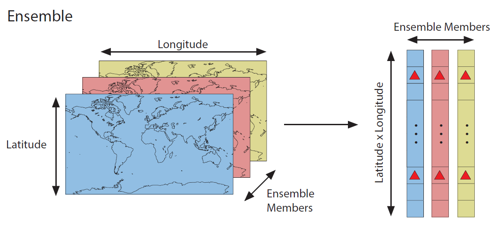

Data Assimilation Primer
========================
Before beginning the workshop, it will be useful to have a basic understanding of data assimilation (DA). On this page, we'll provide an overview of DA and review some common tasks for these analyses. This workshop will focus on implementing a Kalman filter assimilation, so we'll also briefly review this method.

Overview
--------
In the broadest terms, data assimilation combines climate model output (:math:`\mathrm{X_p}`) with proxy records (:math:`\mathrm{Y}`) to create reconstruct a set of target climate variables (:math:`\mathrm{X_a}`). Formally, we can write this as:

.. math::

    \mathrm{X_a} = f(\mathrm{X_p, Y})

The reconstruction proceeds by updating climate variables in the climate model output (:math:`\mathrm{X_p}`) to more closely match the proxy records (:math:`\mathrm{Y}`). The updated climate variables (:math:`\mathrm{X_a}`), sometimes called the (a)nalysis, form the reconstruction.

Two of the most common paleoclimate DA techniques - the Kalman filter, and the particle filter - can be expressed as Bayesian filters. In this context, information from the climate proxy records :math:`\mathrm{Y}` is used to update estimates of state parameters (climate variables) :math:`\mathrm{X}`. Because of this, we will often refer to the initial climate model output :math:`\mathrm{X_p}` as the **prior**, and the updated output :math:`\mathrm{X_a}` as the **posterior**.

State Vectors
-------------
In general, the climate model output is organized into **state vectors**. These consist of spatiotemporal climate model output reshaped into a vector of data values:

.. figure:: images/state-vector.png
    :alt: A blue grid overlies a map of the world. The map is unraveled into a single vector.

    Figure 1: A spatial field is reshaped into a state vector. (Red triangles represent the locations of proxy sites).

There is no strict definition for the contents of a state vector, but they typically include data for one or more climate variables at a set of spatial points. A state vector might also contain a trajectory of successive points in time; for example, individual months of the year or a number of successive years following an event of interest. Essentially, **a state vector serves as a possible description of the climate system** for some period of time.

Ensembles
---------
The DASH toolbox focuses on ensemble DA methods, which rely on state vector **ensembles**. A state vector ensemble is a collection of multiple state vectors organized in a matrix:

    Figure 2: Multiple state vectors are grouped together into an ensemble.

**An ensemble provides an empirical distribution of possible climate states.** For paleoclimate DA, ensemble members are often selected from different points in time, different members of a model ensemble, or both.

In a typical DA algorithm, the state vectors in an ensemble are compared to a set of proxy record values in a given time step. Essentially, the method compares potential descriptions of the climate system (taken from a climate model) to proxy values from the real past climate record. The similarity of each state vector to the proxy records is then informs the final reconstruction.

Proxy Estimates
---------------
In order to compare state vectors with a set of proxy record values, DA methods must transfer the state vectors and proxy records into a common unit space. This is accomplished by applying proxy forward models to relevant climate variables stored in each state vector. Applying a forward model to a state vector produces a value in the same units as the corresponding proxy record, which allows direct comparison of the state vector and observed proxy value.

Typically, DA methods will run a forward model to estimate each proxy record for each state vector in an ensemble. The collective outputs are referred to as the **proxy estimates** (:math:`\mathrm{\hat{Y}}`):

.. figure:: images/estimates.png
    :alt: The left side shows a group of state vectors. An arrow labeled as "Forward Models" points from left to right. The right side shows a cartoon depictions of a tree ring and an ice core for each state vector. These cartoons are labeled as the "Estimates".

    Figure 3: Proxy estimates for a state vector ensemble. Forward models are used to estimate a tree-ring record and an ice-core record for each state vector in the ensemble.

Ultimately, these proxy estimates allow comparison of each state vector with the real proxy records. The difference between the proxy estimates and the real records is known as the **innovation**:

.. figure:: images/innovation.png
    :alt: The left side shows a set of cartoon tree rings and ice cores representing the proxy estimates for an ensemble. An arrow labeled "Direct Comparison" points from left to right. The right side shows a picture of a real tree ring record and a real ice core labeled as "Real proxy records".

    Figure 4: Proxy estimates are compared directly to the real proxy records. The difference between the two is known as the *innovation*.

Written formally:

.. math::

    \mathrm{innovation = Y - \hat{Y}}

The innovation is then used to update the prior ensemble (:math:`\mathrm{X_p}`) so that it more closely resembles the observed proxy records.

Proxy Uncertainties
-------------------
In addition to proxy innovations, the DA methods in DASH also consider proxy uncertainties (:math:`\mathrm{R}`) when comparing state vector to proxy records. More formally:

.. math::

    \mathrm{X_{a}} = f\mathrm{(X_p, Y, R)}

In this way, proxy records with high uncertainties are given less weight in the reconstruction. In classical assimilation frameworks :math:`\mathrm{R}` is usually derived from the uncertainty inherent in measuring an observed quantity (for example, the uncertainty of width measurements in a tree-ring chronology). However, in nearly all paleoclimate applications, measurement uncertainties are small compared to

1. The uncertainties of the proxy forward models, and
2. Uncertainties from non-climatic noise in the proxy records

Thus, in paleoclimate DA, the proxy uncertainties :math:`\mathrm{R}` must account for proxy noise and forward model errors, as well as any covariance between different proxy uncertainties.

Kalman Filter
-------------
When using a Kalman filter, the update equation is:

.. math::

    \mathrm{X_a = X_p + K( Y - \hat{Y})}

The equation indicates that the innovation is weighted by the Kalman Gain matrix (K) in order to compute an update for each state vector. The Kalman Gain weighting considers multiple factors including:

1. The covariance of the proxy estimates (:math:`\mathrm{\hat{Y}}`) with the target climate variables (:math:`\mathrm{X_p}`)
2. The covariance of the proxy estimates (:math:`\mathrm{\hat{Y}}`) with each other, and
3. The proxy uncertainties (:math:`\mathrm{R}`)

Written formally, the Kalman Gain matrix is given by:

.. math::

    \mathrm{K = cov(X, \hat{Y})[cov(\hat{Y}) + R]}^{-1}

You won't need to remember this equation for the workshop, but it can be useful to understand how the assimilation works.

Applying the Kalman Gain to the innovation produces a set of updates. Applying these updates to the prior ensemble (:math:`\mathrm{X_p}`) produces an updated (posterior) ensemble (:math:`\mathrm{X_a}`), such that the climate states (state vectors) in :math:`\mathrm{X_a}` more closely resemble those recorded by the real proxy records.

Typically, we use the mean of this updated ensemble as the final reconstruction. However, the ensemble nature of the posterior is also useful because the distribution of climate variables across :math:`\mathrm{X_a}` can help quantify uncertainty in the reconstruction.
