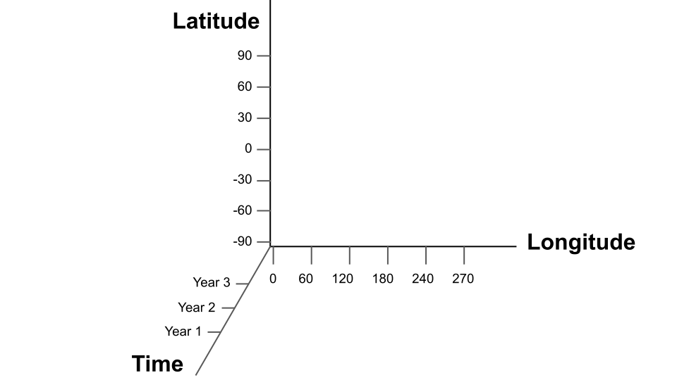

gridfile
========

The ``gridfile`` class is the core class used to organize climate date. The class creates ``gridfile`` objects, which catalogue data stored in various data source files. Each catalogue can span multiple different data files and allows users to load any subset of the catalogued data using a common interface.

How it works
------------

*N-dimensional grid*
++++++++++++++++++++
Each ``gridfile`` object catalogues data on an abstract N-dimensional data grid. This data grid does not actually exist. Rather, the data grid is an abstraction that describes how the data in different files fits together. The dimensions of this grid and their sizes are defined using a ``gridMetadata`` object:

.. figure:: ../images/grid-empty.svg
    :alt: Axes for three dimensions in an empty space. The axes are labeled as latitude, longitude, and time.
    :width: 75%

    An empty, 3-dimensional gridfile catalogue.

*Unique Metadata*
+++++++++++++++++
The dimensions of the grid are associated with the metadata from the ``gridMetadata`` object. This way, each data point on the grid is associated with a particular set of metadata values - essentially, a metadata coordinate:

1, 2, and 3.
    :width: 75%

    An empty, 3-dimensional gridfile catalogue with dimensional metadata.

``gridfile`` requires that each data point is associated with a *unique* metadata coordinate. Thus, although it's fine to repeat metadata values across different dimensions, each individual dimension must use unique metadata values along its length.

Because of this uniqueness, each data point on the grid is associated with a unique set of metadata values. This allows users to load specific data arrays from the grid by querying the associated metadata values. We'll look at loading data in more detail in the next coding session.

*Data source files*
+++++++++++++++++++
 When you create a new ``gridfile`` catalogue, its N-dimensional grid is initially empty. However, you can fill the grid with values by adding data source files to the catalogue. A data source file is a file with some data saved in it. When you add a source file to a catalogue, the contents of the source file are associated with a portion of the N-dimensional grid.

 .. figure:: ../images/grid-sources.svg
     :alt: Axes for latitude, longitude, and time dimensions define the outline of a large cube in three dimensional space. Two smaller cubes are nestled within the outline of the large cube. The first is colored red and labeled as File 1. The second is colored blue and labeled as File 2. The two small cubes do not overlap, and regions of empty space remain in the large cube.
     :width: 75%

     A 3-dimensional gridfile catalogue with two data source files.

Currently, DASH supports the following data file formats: NetCDF, MAT-files, delimited text files, and NetCDF files accessed via OPeNDAP URLs.

``.grid`` *files*
+++++++++++++++++
Each ``gridfile`` catalogue is stored in a file with a ``.grid`` extension. This allows you to reuse data catalogues between different coding sessions. Note that ``.grid`` files do not store the actual data for a gridded dataset (only metadata and the location of source files), so datasets are not duplicated when added to a catalogue.

Features
--------

Now we'll take a quick look at some features of the ``gridfile`` class. This section is just meant as an overview - we'll go in further depth in the next open coding session.

*Load Interface*
++++++++++++++++
One of the most useful feature of ``gridfile`` catalogues is the ability to load data from any portion of the catalogue using the ``load`` command. This command allows users to load data arrays that may span multiple files, and even multiple file formats, without needing to interact with any of the individual files.

Furthermore, the ``load`` command allows users to load specific subsets of the data catalogue by querying specific metadata values. The use of human-readable metadata, rather than array indices or other syntaxes, helps make code more readable and easier to use.

*Fill value and valid range*
++++++++++++++++++++++++++++
You can specify fill values and/or a valid data range for ``.grid`` catalogues. If you specify a fill value, data matching the fill value is converted to NaN when loaded. Similarly, if you specify a valid data range, values outside of the range are converted to NaN upon load. When setting fill values and valid ranges, you can set values for the entire catalogue, or for data in individual source files.

*Data transformations*
++++++++++++++++++++++
``gridfile`` allows you to apply various mathematical transformations to data loaded from a catalogue. The class currently supports:

1. Addition: ``A + X``
2. Multiplication: ``A * X``
3. Linear transform:  ``A + B*X``
4. Exponential: ``exp(X)``
5. Power: ``X^A``
6. Natural log: ``ln(X)``
7. Base-10 log: ``log10(X)``

These transformations are often useful for converting the units of loaded data. You can apply transformations to an entire ``gridfile`` catalogue, or to data in individual source files.

*Cross-catalogue arithmetic*
++++++++++++++++++++++++++++
``gridfile`` includes support for applying arithmetic operations across multiple catalogues. This functionality is similar to `NetCDF Operator`_ (NCO) commands, but can be applied to any ``gridfile`` catalogue, regardless of the formats of data source files. These arithmetic commands are often used when a climate variable of interest must be calculated using multiple output variables from a climate model.

.. _NetCDF Operator: https://nco.sourceforge.net/

*And more!*
+++++++++++
The ``gridfile`` class supports a number of other methods that we will not detail in this workshop. However, you can read about all supported ``gridfile`` commands by entering ``dash.doc("gridfile")`` in the Matlab console.
