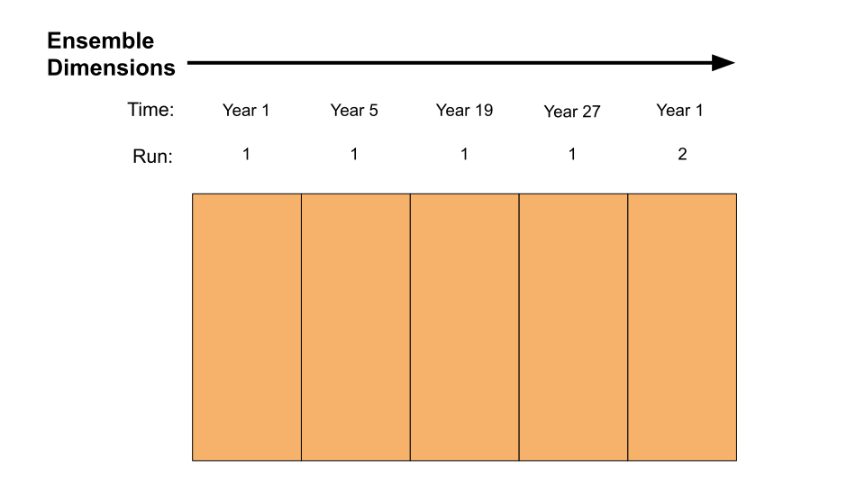
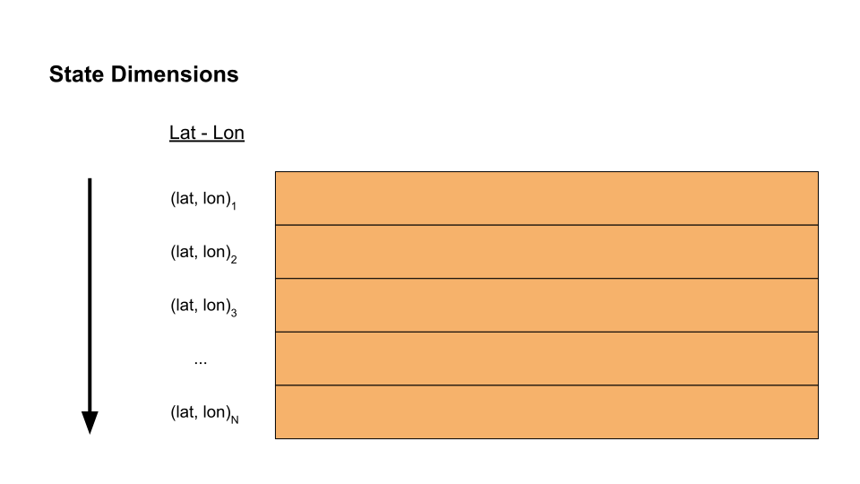
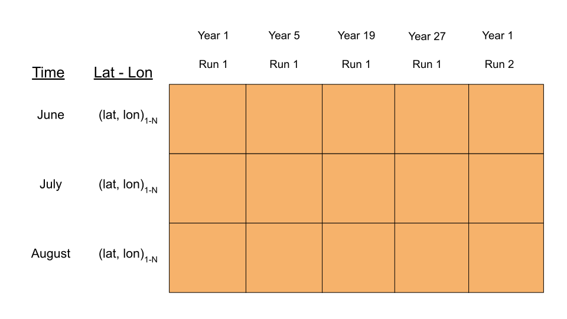

``stateVector`` Concepts
========================

The ``stateVector`` class is used to design and build state vector ensembles. The class implements ``stateVector`` objects, which act as design templates for state vector ensembles. Users can edit a template to describe an ensemble that matches their requirements. When finished, they can then use the template to automatically build a state vector ensemble that conforms to its design.

The ``stateVector`` design templates allow you to design a state vector in a flexible manner, while limiting the manipulation of large data arrays. To facilitate the design process, we will need some vocabulary to help us describe state vector ensembles in a systematic way. The remainder of this page introduces some key concepts that will allow us to flexibly design diverse state vector ensembles.

State Vectors
-------------

State vectors are a fundamental concept for ensemble-based assimilation methods. In brief, a **state vector** is a collection of climate variables and parameters that describe the state of the climate system over some period of time. These variables are reshaped into a vector of data values, hence a "state vector". Typically, state vectors are constructed from climate model output, so each state vector provides one **potential** description of the climate system (or at least, the part of the system that we're interested in). There is no strict definition for the contents of a state vector, but they often contain one or more climate variables at a set of spatial points. In some cases, a state vector may include a trajectory of several points in time - for example, successive months of the year, or successive years after a volcanic event.

In the context of assimilation, state vectors will generally include two types of variables:

1. Reconstruction targets, and
2. Climate variables used to run proxy forward models

In some cases, a variable can fall into both categories.

Whatever the application, a state vector can include data from a variety of climate variables at different spatial and temporal resolutions. Figure 1 illustrates an example state vector.

.. figure:: ../images/state-vector.svg
    :alt: A single column runs from the top of the figure to the bottom and is labeled as a state vector. The column has three colored sections. A long, light-orange section runs from the top to the center and is labeled as monthly, gridded temperature. A short, dark-orange section in the center is labeled as annual, global mean temperature. A long, blue section runs from the center to the bottom and is labeled as monthly, gridded precipitation.

    Figure 1: A state vector with temperature, mean temperature, and precipitation variables.

This example state vector includes data derived from two different climate variables (temperature and precipitation), data with different spatial resolutions (global-mean and spatial gridded), and different temporal resolutions (annual and monthly). Most likely, this state vector describes the state of the climate system for some modeled year.

Ensembles
---------

The ``DASH`` toolbox focuses on *ensemble* DA methods, which rely on state vector ensembles. A state vector **ensemble** is a collection of multiple state vectors organized into a matrix. Since each individual state vector represents a possible description of the climate system, an ensemble provides an empirical *distribution* of possible climate states. For paleoclimate applications, the state vectors in an ensemble are typically selected from:

A. Different time steps,
B. Different climate models, and/or
C. Different model runs

and we often refer to the different state vectors in an ensemble as **ensemble members**.

Continuing the previous example, a small ensemble for our state vector might look like:

.. figure:: ../images/ensemble.svg
    :alt: Five state vector columns are aligned into a matrix. The first column is labeled as Year 1, Run 1. The second is Year 5, Run 1. The third is Year 19, Run 1. The fourth is Year 27, Run 1. The fifth is Year 1, Run 2.

    Figure 2: An example ensemble (N=5) selected from different time points and/or model runs.

Here, each column is a different state vector (ensemble member). Each ensemble member has data for the temperature, mean temperature, and precipitation variables, but from different time steps. In the case of ensemble member 5, the ensemble member is from the same time step as ensemble member 1, but from a different climate model run.

.. _svv:

State Vector Variables
----------------------
The ``stateVector`` class uses data from ``gridfile`` data catalogues to build state vector ensembles. In this workshop, we will often refer to state vector variables. In the context of DASH, we define a **state vector variable** as some subset of data from a gridfile. Multiple variables can be derived from the same gridfile, and each individual variable forms a contiguous block of the state vector.

Returning to our earlier figure:

.. figure:: ../images/state-vector.svg
    :alt: A single column runs from the top of the figure to the bottom and is labeled as a state vector. The column has three colored sections. A long, light-orange section runs from the top to the center and is labeled as monthly, gridded temperature. A short, dark-orange section in the center is labeled as annual, global mean temperature. A long, blue section runs from the center to the bottom and is labeled as monthly, gridded precipitation.

    Figure 1: A state vector with temperature, mean temperature, and precipitation variables.

we can see that the example state vector includes three variables: temperature (**T**), global mean temperature (**Tmean**), and precipitation (**P**). The **T** and **Tmean** variables are probably derived from the same gridfile (and possibly the **P** variable as well).

Note that the definition of a state vector variable says nothing about specific *climate* variables. In fact, a given state vector variable can even include multiple climate variables, so long as those climate variables are derived from the same gridfile. (This can occur when a gridfile includes a ``var`` dimension with multiple variables). We'll discuss state vector variables again in the :ref:`next coding session <sv.add>`. For now, the important point is that each variable is built from data in an associated gridfile.

Ensemble and State Dimensions
-----------------------------
In the ``DASH`` toolbox, we will often refer to "state dimensions" and "ensemble dimensions". These dimensions refer to the gridfile dimensions associated with each state vector variable. In brief, an **ensemble dimension** is a gridfile dimension used to select different ensemble members. For example, the ``time`` and ``run`` dimensions are often ensemble dimensions, because we often select different ensemble members from different time steps and/or model runs. Ensemble dimensions have constant metadata values along each column of an ensemble. Equivalently, ensemble dimensions have constant metadata values for each ensemble member. Ultimately, the metadata values over all the ensemble dimensions forms a unique metadata coordinate for each ensemble member.

Zooming in on the temperature (**T**) variable in our example ensemble:

 value for time, and a specific metadata value for run. The lines dividing the columns indicate that each set of metadata values is fixed along each column.

    Figure 3: Ensemble dimensions for a state vector ensemble.

we can see that ``time`` and ``run`` are the ensemble dimensions, because individual ensemble members are selected from different (time, run) coordinates. Each ensemble member (column) is associated with fixed ``time`` metadata and fixed ``run`` metadata, although these metadata values change between individual ensemble members (columns). Note that the ``time = 1`` metadata value is repeated in ensemble members 1 and 5, but that the total metadata coordinate (time=1, run=1) and (time=1, run=2) is unique to each ensemble member.

.. _state-dims:

By contrast, **state dimensions** are the remaining gridfile dimensions - that is, they are the dimensions that **are not** used to select ensemble members. State dimensions have constant metadata values along each row of a state vector ensemble (this is somewhat the inverse of ensemble dimensions). Continuing the example:

 metadata value for lon. The lines dividing the rows indicate that each set of metadata values is fixed along each row.

    Figure 4: State dimensions for a state vector ensemble.

we can see that ``lat`` and ``lon`` are the state dimensions, because each individual state vector elements are selected from different (lat, lon) coordinates. Each state vector element (rows) is associated with fixed ``lat`` metadata and fixed ``lon`` metadata, although these metadata values can change between individual rows.

As you design variables in a state vector ensemble, you will eventually specify each gridfile dimension as either a state dimension or an ensemble dimension. This specification will help the ``stateVector`` class to automatically build a state vector ensemble from a particular design template. A common breakdown of dimensions is:

* **State Dimensions**: ``lon``, ``lat``, ``lev``, ``site``, and/or ``var``
* **Ensemble Dimensions**: ``time`` and/or ``run``

However, this is just a rule of thumb and not a strict requirement. Depending on your application, any dimension could be a state dimension or ensemble dimension.

.. _sequences:

Sequences
---------
In some cases, you may want an ensemble dimension to also have some structure down the state vector. This most often occurs when you want a state vector to include several sequential points in time, and so we refer to this case as a **sequence**.

For example, you may want a state vector to include data from each month of the year. Although the ``time`` metadata associated with each ensemble member will refer to a particular year, individual state vector elements will also be associated with some ``time`` metadata - in this case, the month of the ensemble member's year.

Analogously, you may want a state vector to include data from several years following a major event (such as a volcanic eruption). Although the ``time`` metadata associated with each ensemble member will refer to the eruption, individual state vector elements will also be associated with ``time`` metadata - in this case, the number of elapsed years since the event.

Returning to the previous figures, let's say I want the **T** temperature variable to include the spatial temperature grid from each of June, July, and August. In this case, the state vector ensemble for the **T** variable would have the following structure:

ssociated with particular months. Each row has time metadata associated with it, and the rows are labeled as June, July, and August. Each row also has lat and lon metadata. The lat and lon metadata indicate that each row contains data values for all N spatial points.

    Figure 5: An example of a sequence for the time dimension. Each ensemble member (column) has time metadata listing the associated year. Each state vector element (row) has time metadata indicating a particular month.

We can see that ``time`` is an ensemble dimension and each ensemble member (column) has fixed ``time`` metadata listing the associated year. However, each state vector element (row) *also* has fixed ``time`` metadata listing the associated month. Because ``time`` is an ensemble dimension, but also has structure along the state vector, this state vector exhibits a sequence for the ``time`` dimensions.
