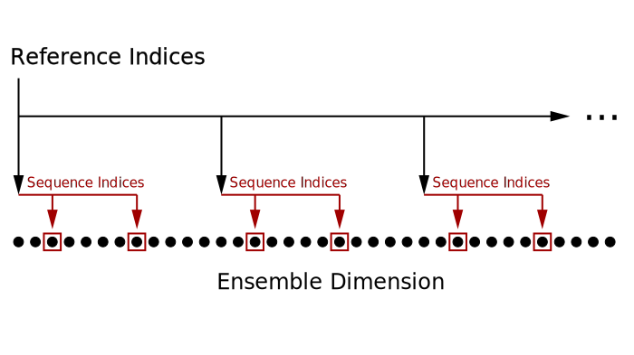
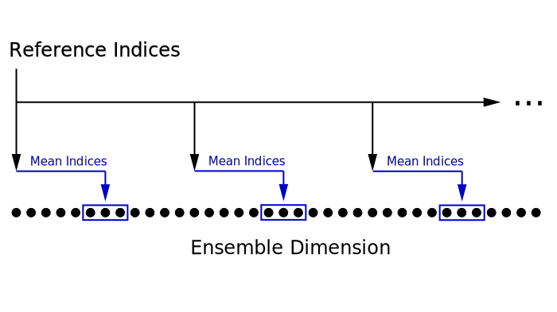
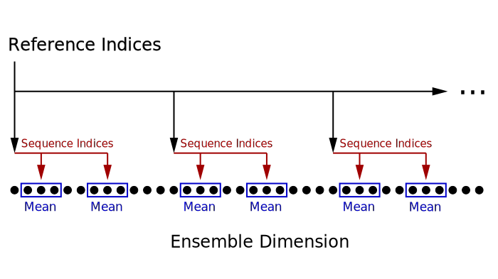
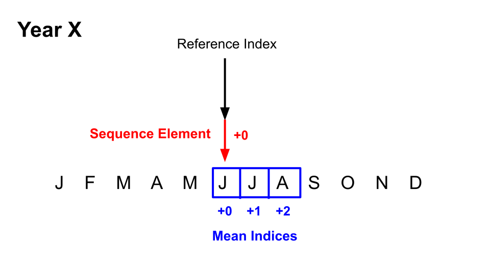

stateVector Indices
===================
As :ref:`previously mentioned <svv>`, the ``stateVector`` class uses data from gridfiles to build a state vector ensemble. However, in most cases, we will only need a small subset of the data in a gridfile. Thus, when you design the template for a state vector ensemble, you'll use various types of indices to select the relevant data and implement design concepts like sequences.

On this page, we'll give an overview of the various types of indices used to build state vector ensembles. We'll also illustrate how these indices interact, in order to better explain how the ``stateVector`` class functions "under-the-hood". In general, state vector indices are defined within the scope of individual variables. Each variable may implement different sets of indices, and the indices are interpreted relative to the variable's associated gridfile.

State Indices
-------------
**State indices** indicate the elements along a state dimension that will be included in the state vector. For a given variable, each state dimension has an accompanying set of state indices. These state indices refer to the elements along the dimension in the variable's gridfile.

.. _ref-indices:

Reference Indices
-----------------
**Reference indices** indicate the elements along an ensemble dimension that *can* be used to select ensemble members. Essentially, these indices point to metadata values that serve as reference points for potential members of an ensemble. It is important here to distinguish between reference indices and reference points. A reference index points to a particular element along an ensemble dimension. A **reference point** is the metadata value associated with that element.

.. figure:: ../images/abstract-reference-indices.svg
    :alt: A series of dots proceeds from left to right. The dots are labeled as elements along an ensemble dimension. A series of arrows, labeled as "Reference indices" point to three random dots along the line.

    Figure 1: Reference indices point to elements along an ensemble dimension. The metadata values at the specified elements are the reference points.

As an example, say I have a variable with ``time`` as an ensemble dimension. The ``time`` dimension in the variable's gridfile extends from 850 CE to 2005 CE at monthly resolution::

    time = datetime(850,1,15) : calmonths(1) : datetime(2005,12,15)

Suppose I want to always select ensemble members from the month of June. I could use::

    juneIndices = month(time)==6;

to create reference indices for the variable. These reference indices point to the 1156 June months along the time dimension:

.. figure:: ../images/example-reference-indices.svg
    :alt: The individual months of the year are displayed for the years from 850 to 2005. A set of arrows, labeled as "Reference indices" point to each June month. So June 850, June 851, June 852, etc.

    Figure 2: Reference indices for an ensemble built from June time steps.

These June time steps are the reference points for building an ensemble. In this example, ensemble members could be selected from any of June 850, June 851, June 852, ..., June 2003, June 2004, June 2005.

How DASH selects ensemble members
---------------------------------
Thus far, we have only discussed reference indices in the context of a single variable. However as previously mentioned, reference indices are defined individually for each variable in a state vector. This raises the question: How does ``stateVector`` deal with multiple sets of reference indices?

Ultimately, the class relies on the reference points for each variable - that is, the metadata values associated with each variable - rather than the direct reference indices. When selecting ensemble members, the ``stateVector`` class uses the following algorithm:

1. Obtain the reference points for each variable
2. Determine the set of reference points common to **all** variables in the state vector.
3. Discard any reference points not in this set

The class will then select ensemble members from the remaining reference points, which are common to all variables in the state vector. This ensures that every ensemble member is complete, even when gridfile catalogues have different ranges along a dimension.

.. important::
    By default, the ``stateVector`` class will ensure that all data within an ensemble member correspond to the same reference points. This way, all variables represent the same time step / model run / etc.

At this point, you may be wondering: If ``stateVector`` only cares about metadata values, then why bother with reference indices? Why not just use the metadata values directly?

As we will see in the next two sections, using indices will allow us to implement other design features. Specifically, they will let us implement sequences and means along ensemble dimensions.

.. _sequence-indices:

Sequence Indices
----------------
As :ref:`previously discussed <sequences>`, you may want an ensemble dimension to exhibit some structure down the state vector. Typically, this occurs when a state vector should include data from several points in time. You can use sequence indices to implement these features. Like state and reference indices, sequence indices are defined individually for the dimensions of each variable. Since only ensemble dimensions can exhibit a sequence, you can only define sequence indices for ensemble dimensions.

Each set of **sequence indices** lists a series of offsets. These offsets are applied to the :ref:`reference indices <ref-indices>` of the ensemble dimension to yield a set of adjusted indices, which we refer to as **sequence elements**. These sequence elements indicate the elements along the dimension that should be used in each potential ensemble member.

 of each black arrow. These red arrows are labeled as "sequence indices" and they point to the elements several points after the black arrows. The elements indicated by the red arrows have red boxes around them. The same red arrows are applied to each black arrow.

    Figure 3: Sequence indices modify the reference indices of an ensemble dimension. The offset indices (sequence elements) point to the data elements that should be used in a sequence for a particular ensemble member.

Building off the example in Figure 2, let's say I want the state vector to include data from each of June, July, and August, so that my desired ensemble resembles the following:

.. figure:: ../images/jja-sequence.svg
    :alt: A matrix representing an ensemble is divided into 3 rows and 5 columns. Each row and column is labeled with time metadata. The rows are labeled as June, July, and August. The columns are labeled with 5 random years from the Common Era.

    Figure 4: A variable with a June, July, August sequence.

Since the reference indices point to individual June months, the sequence indices should indicate the offsets between each June reference point, and the associated June, July, and August. Since each June *is* the reference point, the offset for June (along the time dimension) is 0. Since each July occurs one time step after its associated June, the offset for July is 1. Similarly, the offset for August in 2. This gives our sequence indices::

    sequenceIndices = [0 1 2];

Using these sequence indices, each ensemble member will include data from each of these three sequence elements:

.. figure:: ../images/example-sequence-indices.svg
    :alt: The top of the figure is labeled as year X. The figure displays 12 months of the year. A black arrow labeled as "Reference index" points to June. A red +0 leads to a red box around June. A red +1 leads to a red box around July. A red +2 leads to a red box around August. The three red boxes are labeled as sequence elements.

    Figure 5: Sequence indices (red numbers) are applied as offsets to the reference index. The offset indices are the sequence elements (red boxes), and indicate the data elements used in the state vector variable.

Sequence indices are quite flexible. They do not need to be evenly spaced (and don't even need to be sorted). They can contain negative elements (for time steps *before* a reference point), and do not need to include 0. Note that if the sequence indices do not contain zero, then the variable will not contain data from the reference point itself. It will only contain data from the indicated sequence elements.

.. note::
    The ``stateVector`` class will only select ensemble members that allow for complete sequences. The class will discard any ensemble members in which a sequence requires data outside of the associated gridfile.

.. _mean-indices:

Mean Indices
------------
Implementing a mean over state dimensions is relatively straightforward, as ``stateVector`` can simply implement a mean over the data elements included in the state vector. However, you may also want to implement means over ensemble dimensions. For example, you may want each ensemble member to implement a temporal mean, or a mean over multiple model runs. We will use mean indices to implement means over ensemble dimensions.

**Mean indices** function similarly to sequence indices and also list a series of offsets applied to :ref:`reference indices <ref-indices>`. However, ``stateVector`` then takes a mean over the indicated data elements, rather than implementing a sequence.

arrow. These blue arrows, labeled as "mean indices", point to several data elements after each black arrow. There is a blue box around each set of data elements. The same blue arrow is applied to each black arrow.

    Figure 6: Mean indices modify the reference indices of an ensemble dimension. The offset indices point to the data elements that should be used in a mean for each ensemble member.

Returning to the example figures, let's say I want the state vector to implement a June-July-August seasonal mean, rather than a sequence. In this case, the desired state vector ensemble would resemble the following:

.. figure:: ../images/jja-mean.svg
    :alt: A matrix representing an ensemble is divided into 5 columns. Each column is labeled with time metadata. The metadata for each column indicates a June-July-August seasonal mean from a random year in the Common Era.

    Figure 7: A variable with a June, July, August seasonal mean.

Since the reference indices point to individual June months, the mean indices should indicate the offsets between each June reference point, and the associated June, July, and August included in the mean. Since each June *is* the reference point, the offset for June (along the time dimension) is 0. Since each July occurs one time step after its associated June, the offset for July is 1. Similarly, the offset for August in 2. This gives our mean indices::

        meanIndices = [0 1 2];

Using these mean indices, each ensemble member will implement a mean over the associated three elements:

.. figure:: ../images/example-mean-indices.svg
    :alt: The top of the figure is labeled as year X. The figure displays 12 months of the year. A black arrow labeled as "Reference index" points to June. A blue +0 leads to a blue box around June. A blue +1 leads to a blue box around July. A blue +2 leads to a red box around August. The three blue numbers are labeled as mean indices.

    Figure 8: Mean indices (blue numbers) are applied as offsets to the reference index. The state vector variable will implement a mean over the selected data elements (data elements in blue boxes).

As with sequence indices, mean indices do not need to be evenly spaced or sorted. They may contain negative values and do not need to contain zero. Note that if the mean indices do not contain zero, then the variable will not contain data from the reference point itself. It will only contain data from the indicated mean elements.

.. note::
    The ``stateVector`` class will only select ensemble members that allow for complete means. The class will discard any ensemble members in which a mean requires data outside of the associated gridfile.

Combining sequences and means
-----------------------------
In some cases, you may want a state vector to implement a sequence of means. For example, a series of seasonal means within a year, or a series of decadal means following a climate event. When this occurs, you will need to use both sequence indices and mean indices. When you provide both sets of indices, ``stateVector`` uses the following procedure to build an ensemble member:

1. Locate the ensemble member's reference point
2. Apply sequence index offset to locate the sequence elements
3. Apply mean indices to each individual sequence element

The procedure is summarized in the following figure:

h black arrow. These red arrows are labeled as "sequence indices" and they point to various elements several points after each black arrow. A blue box surrounds several elements at the end of each red arrow. The blue boxes are labeled as "Mean indices".

    Figure 9: Combining sequence and mean indices. First, sequence indices modify the reference indices of an ensemble dimension. The offset indices form a reference point for each sequence element. Next, the mean indices are applied to each sequence element. The offset sequence elements point to the data elements used in the mean for each element of the sequence.

Returning to the example, let's say I want each state vector to implement a moving, three-month seasonal mean from June-July-August (JJA) to September-October-November (SON). In this case, the state vector ensemble would resemble the following:

.. figure:: ../images/ms-ensemble.svg
    :alt: A matrix representing an ensemble is divided into 5 columns and 4 rows. The rows are labeled as JJA, JAS, ASO, and SON - representing seasonal means from June-July-August to September-October-November. The columns are labeled with different years of the Common Era.

    Figure 10: A variable with a sequence of seasonal means.

To implement this, we'll start by using sequence indices to locate the starting month of each seasonal mean. Since the reference indices point to individual June months, the sequence indices should indicate the offset between each June month and the associated June, July, August, and September. This gives us::

    sequenceIndices = [0 1 2 3];

Next, we'll use mean indices to locate the months that should be used in each seasonal mean. Since the sequence elements point to the starting month of each seasonal mean, the mean indices should indicate the offset between each starting month and the months used in the seasonal mean. This gives us::

    meanIndices = [0 1 2];

Using these indices, first sequence element will implement a JJA seasonal mean:

    Figure 11: The first sequence element - a JJA seasonal mean.

The second sequence element will be a JAS seasonal mean:

.. figure:: ../images/ms2.svg

    Figure 12: The second sequence element - a JAS seasonal mean

and so on.
